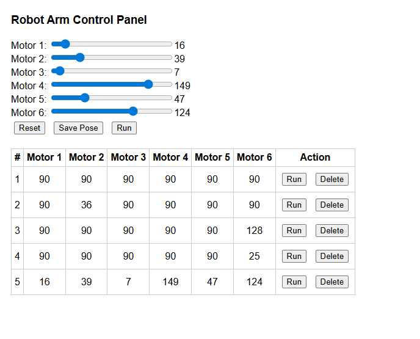

# Robot Arm Control Panel

## Introduction
This project is a simple web-based control panel for a robot arm. It allows the user to adjust the angles of 6 motors using sliders, save different positions (poses), and load or run them. The project connects the interface to a database using PHP and MySQL, and the stored poses can be reused or deleted.

---

## What I Used
- HTML for structure
- CSS for basic styling
- JavaScript to control interactions
- PHP for backend logic
- phpMyAdmin to manage the database (MySQL)

---

## Code and Explanation
This is how I save a pose into the database using PHP:
### save_pose.php
```php
$conn = new mysqli("localhost", "root", "", "robot_db");
$stmt = $conn->prepare("INSERT INTO poses (motor1, motor2, motor3, motor4, motor5, motor6) VALUES (?, ?, ?, ?, ?, ?)");
$stmt->bind_param("iiiiii", $_POST['motor1'], $_POST['motor2'], $_POST['motor3'], $_POST['motor4'], $_POST['motor5'], $_POST['motor6']);
$stmt->execute();
```
This part shows how the table is displayed using PHP:
### list_poses.php
```php
$conn = new mysqli("localhost", "root", "", "robot_db");
$res = $conn->query("SELECT * FROM poses");
$i = 1;
while ($row = $res->fetch_assoc()) {
  echo "<tr>
    <td>$i</td>
    <td>{$row['motor1']}</td>
    <td>{$row['motor2']}</td>
    <td>{$row['motor3']}</td>
    <td>{$row['motor4']}</td>
    <td>{$row['motor5']}</td>
    <td>{$row['motor6']}</td>
    <td>
      <button onclick='runPose({$row['id']})'>Run</button>
      <button onclick='removePose({$row['id']})'>Delete</button>
    </td>
  </tr>";
  $i++;
}
```

---

## Output
Below is a screenshot of the control panel with saved poses:


---

## What I Learned
- How to use sliders and forms in HTML
- How to use JavaScript to handle form data
- How to connect frontend to backend using PHP
- How to create and use tables in phpMyAdmin
- How to update and retrieve data from a MySQL database
